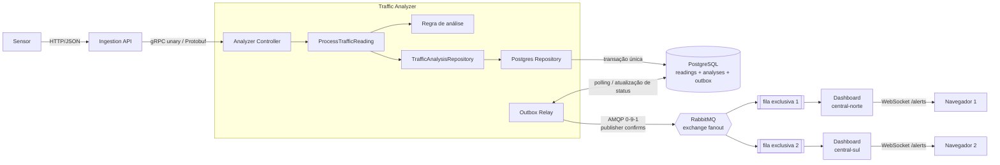

# Urban Traffic Monitor

MVP de um ecossistema de IoT para monitoramento de trânsito urbano. Sensores enviam telemetria por HTTP/JSON, a API solicita a análise por gRPC/Protocol Buffers e o Traffic Analyzer persiste o resultado no PostgreSQL. Quando há um possível acidente, o alerta é distribuído às centrais ativas por Transactional Outbox, RabbitMQ e WebSocket.

## Arquitetura



O ponto importante do broadcast é que a exchange `fanout` não entrega diretamente aos navegadores nem compartilha uma única fila entre as centrais. Cada instância do dashboard declara sua própria fila exclusiva e temporária; assim, o RabbitMQ coloca uma cópia do evento em cada fila e todas as instâncias ativas recebem o alerta.

O fluxo síncrono termina quando o Analyzer devolve a análise à API por gRPC. A publicação do alerta ocorre separadamente: leitura, análise e evento de outbox são gravados atomicamente no PostgreSQL, e o relay publica depois. O protótipo considera acidente quando a velocidade é menor ou igual a 2 km/h e a ocupação é de pelo menos 75%.

## Organização do código

```text
.
|-- database/init.sql
|-- proto/traffic.proto
|-- src
|   |-- analyzer
|   |   |-- interfaces/       # controller gRPC (adaptador de entrada)
|   |   |-- usecases/         # regras e orquestração da aplicação
|   |   |-- ports/            # contratos exigidos pelo caso de uso
|   |   |-- infrastructure/   # adaptador PostgreSQL
|   |   `-- services/         # relay da Transactional Outbox
|   |-- ingestion/interfaces/ # controller HTTP/JSON
|   |-- dashboard/interfaces/ # consumidor AMQP e servidor WebSocket
|   |-- public/index.html     # mini-cliente para testar WebSocket
|   `-- shared/               # contratos e configuração dos protocolos
|-- Dockerfile
`-- docker-compose.yml
```

As dependências do núcleo apontam para abstrações: `ProcessTrafficReading` conhece a porta `TrafficAnalysisRepository`, mas não conhece PostgreSQL, RabbitMQ, Express ou gRPC. O `server.ts` de cada serviço funciona como composition root, criando adaptadores e injetando as dependências.

## Pré-requisitos

- Docker Desktop ou Docker Engine com o plugin Compose v2;
- portas `3000`, `50051`, `5432`, `5672`, `8081`, `8082` e `15672` livres.

Não é necessário instalar Node.js para a execução com Docker.

## Como executar, passo a passo

1. No terminal, entre na raiz do projeto (a pasta que contém `docker-compose.yml`).

2. Construa as imagens e inicie todos os serviços:

   ```bash
   docker compose up --build -d
   ```

3. Acompanhe a inicialização até os serviços estarem prontos:

   ```bash
   docker compose ps
   docker compose logs -f ingestion-api traffic-analyzer dashboard-1 dashboard-2
   ```

   Use `Ctrl+C` apenas para sair da visualização dos logs; os contêineres continuam executando.

4. Confira os endpoints HTTP:

   ```bash
   curl http://localhost:3000/health
   curl http://localhost:8081/health
   curl http://localhost:8082/health
   ```

5. Abra os dois mini-clientes no navegador:

   - http://localhost:8081 — `central-norte`;
   - http://localhost:8082 — `central-sul`.

6. Em outro terminal, envie a leitura de acidente mostrada na seção de testes. Os dois painéis devem exibir o mesmo `eventId`, cada um com seu próprio valor em `deliveredBy`.

7. Ao terminar, pare e remova os contêineres:

   ```bash
   docker compose down
   ```

   O volume do PostgreSQL é preservado. Para apagar também os dados e reiniciar o banco vazio, use conscientemente `docker compose down -v`.

### Serviços e portas

| Serviço | Endereço externo | Finalidade |
|---|---|---|
| Ingestion API | http://localhost:3000 | entrada HTTP de telemetria |
| Traffic Analyzer | `localhost:50051` | servidor gRPC |
| Dashboard norte | http://localhost:8081 | cliente web e WebSocket |
| Dashboard sul | http://localhost:8082 | cliente web e WebSocket |
| RabbitMQ Management | http://localhost:15672 | interface do broker (`guest` / `guest`) |
| PostgreSQL | `localhost:5432` | banco `traffic_monitor` (`traffic` / `traffic`) |

## Como testar

### Teste rápido de acidente

Em Linux/macOS ou Git Bash:

```bash
curl -X POST http://localhost:3000/api/v1/readings \
  -H 'Content-Type: application/json' \
  -d '{
    "readingId": "demo-acidente-001",
    "sensorId": "radar-104",
    "latitude": -23.5505,
    "longitude": -46.6333,
    "averageSpeedKmh": 0,
    "vehicleCount": 87,
    "occupancyPercent": 95
  }'
```

No PowerShell:

```powershell
$body = @{
  readingId = "demo-acidente-001"
  sensorId = "radar-104"
  latitude = -23.5505
  longitude = -46.6333
  averageSpeedKmh = 0
  vehicleCount = 87
  occupancyPercent = 95
} | ConvertTo-Json

Invoke-RestMethod -Method Post `
  -Uri http://localhost:3000/api/v1/readings `
  -ContentType "application/json" `
  -Body $body
```

Resultado esperado: HTTP `202`, `analysis.status` igual a `ACCIDENT` e o alerta visível nos dois dashboards.

### Outros payloads

Para testar fluxo normal, reutilize o JSON completo e altere `readingId` para `demo-normal-001`, `averageSpeedKmh` para `50` e `occupancyPercent` para `30`. O status esperado é `NORMAL`.

Para testar congestionamento sem acidente, use `readingId` igual a `demo-congestionado-001`, `averageSpeedKmh` igual a `15` e `occupancyPercent` igual a `70`. O status esperado é `CONGESTED`.

Os dois casos não geram evento nos dashboards. O `readingId` é a chave de idempotência: reenviar exatamente o payload de acidente com `readingId: "demo-acidente-001"` devolve a análise já gravada e não cria outro evento de outbox.

### Postman e mini-cliente WebSocket

Importe a collection [`docs/Urban-Traffic-Monitor.postman_collection.json`](docs/Urban-Traffic-Monitor.postman_collection.json) no Postman. Ela contém health check e exemplos de fluxo normal, congestionamento, acidente e reenvio idempotente. O arquivo [`src/public/index.html`](src/public/index.html) é o mini-cliente WebSocket servido automaticamente pelas duas instâncias do dashboard.

### Conferir a persistência

```bash
docker compose exec postgres psql -U traffic -d traffic_monitor \
  -c "SELECT reading_id, status, event_id FROM traffic_analyses ORDER BY analyzed_at DESC;"

docker compose exec postgres psql -U traffic -d traffic_monitor \
  -c "SELECT id, event_type, status, attempts FROM outbox_events ORDER BY created_at DESC;"
```

### Testes automatizados

Para desenvolvimento local, instale Node.js 22 e execute:

```bash
npm ci
npm run build
npm test
```

## Endpoints

- `POST /api/v1/readings`: valida a telemetria, chama o Analyzer, persiste a leitura/análise e devolve o resultado;
- `GET /health`: saúde da API de ingestão ou da instância de dashboard;
- `GET /instance`: identifica a instância do dashboard;
- `WS /alerts`: canal de alertas entre uma instância do dashboard e seus navegadores.

## Consistência e entrega

O adaptador PostgreSQL executa uma única transação local para inserir `traffic_readings`, `traffic_analyses` e, quando necessário, `outbox_events`. O `OutboxRelay` reivindica eventos pendentes com `FOR UPDATE SKIP LOCKED`, publica com publisher confirms e então marca os registros como `PUBLISHED`.

Se o processo cair depois da confirmação do broker e antes da atualização da outbox, um alerta pode ser reenviado. Portanto, a garantia é **pelo menos uma vez**. Os dashboards deduplicam por `eventId` em memória.

Consulte [`ADR.md`](ADR.md) para as decisões e trade-offs e [`ARQUITETURA_PERSISTENCIA.md`](ARQUITETURA_PERSISTENCIA.md) para a análise detalhada da persistência.

## Limitações e evolução

As filas exclusivas representam somente instâncias ativas. Uma central offline não recebe os alertas ocorridos durante a indisponibilidade. Se esse requisito mudar, cada central deverá usar uma fila durável nomeada e uma Inbox persistente para deduplicação. Outras evoluções naturais são autenticação dos sensores, TLS, DLQ, métricas e tracing distribuído.
